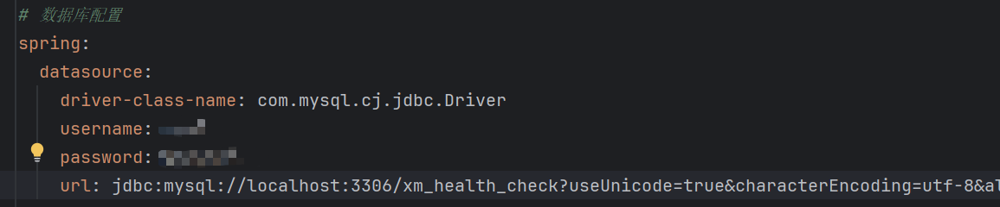
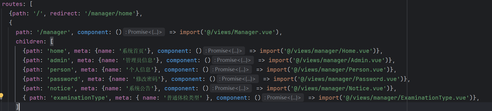
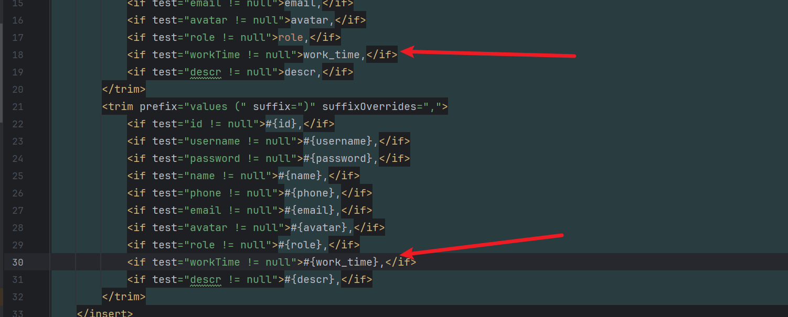
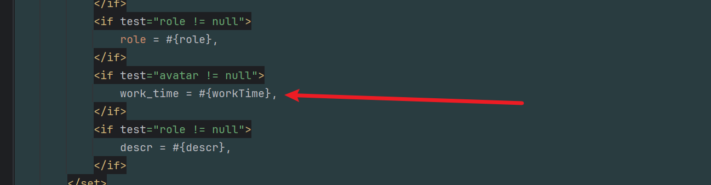

# health-check

## 1.导入并运行项目脚手架

### 后端

数据库配置




### 前端

配置环境

```vue
npm install
```


## 2.普通体检类型管理功能

此功能与脚手架中的系统公告差不多，直接复制粘贴

### 后端

#### entity

体检类型***ExaminationType***

```java
public class ExaminationType {

    private Integer id;
    private String name;

    public Integer getId() {
        return id;
    }

    public void setId(Integer id) {
        this.id = id;
    }

    public String getName() {
        return name;
    }

    public void setName(String name) {
        this.name = name;
    }
}
```


#### controller

前端访问的接口***ExaminationTypeController.java***

```java
@RestController
@RequestMapping("/examinationType")
public class ExaminationTypeController {

    @Autowired
    private ExaminationTypeService examinationTypeService;

    /**
     * 新增
     */
    @PostMapping("/add")
    public Result add(@RequestBody ExaminationType examinationType) {
        examinationTypeService.add(examinationType);
        return Result.success();
    }

    /**
     * 修改
     */
    @PutMapping("/update")
    public Result update(@RequestBody ExaminationType examinationType) {
        examinationTypeService.updateById(examinationType);
        return Result.success();
    }

    /**
     * 单个删除
     */
    @DeleteMapping("/delete/{id}")
    public Result delete(@PathVariable Integer id) {
        examinationTypeService.deleteById(id);
        return Result.success();
    }

    /**
     * 批量删除
     */
    @DeleteMapping("/delete/batch")
    public Result delete(@RequestBody List<Integer> ids) {
        examinationTypeService.deleteBatch(ids);
        return Result.success();
    }

    /**
     * 单个查询
     */
    @GetMapping("/selectById/{id}")
    public Result selectById(@PathVariable Integer id) {
        ExaminationType examinationType = examinationTypeService.selectById(id);
        return Result.success(examinationType);
    }

    /**
     * 查询所有
     */
    @GetMapping("/selectAll")
    public Result selectAll(ExaminationType examinationType) {
        List<ExaminationType> list = examinationTypeService.selectAll(examinationType);
        return Result.success(list);
    }

    /**
     * 分页查询
     */
    @GetMapping("/selectPage")
    public Result selectPage(ExaminationType examinationType,
                             @RequestParam(defaultValue = "1") Integer pageNum,
                             @RequestParam(defaultValue = "10") Integer pageSize) {
        PageInfo<ExaminationType> pageInfo = examinationTypeService.selectPage(examinationType, pageNum, pageSize);
        return Result.success(pageInfo);
    }

}
```


#### service和mapper

***ExaminationTypeService***

```java
package com.example.service;

import cn.hutool.core.date.DateUtil;
import com.example.entity.ExaminationType;
import com.example.mapper.ExaminationTypeMapper;
import com.github.pagehelper.PageHelper;
import com.github.pagehelper.PageInfo;
import org.springframework.beans.factory.annotation.Autowired;
import org.springframework.stereotype.Service;

import java.util.List;

@Service
public class ExaminationTypeService {

    @Autowired
    private ExaminationTypeMapper examinationTypeMapper;

    public void add(ExaminationType examinationType) {
        examinationTypeMapper.insert(examinationType);
    }

    public void updateById(ExaminationType examinationType) {
        examinationTypeMapper.updateById(examinationType);
    }

    public void deleteById(Integer id) {
        examinationTypeMapper.deleteById(id);
    }

    public void deleteBatch(List<Integer> ids) {
        for (Integer id : ids) {
            examinationTypeMapper.deleteById(id);
        }
    }

    public ExaminationType selectById(Integer id) {
        return examinationTypeMapper.selectById(id);
    }

    public List<ExaminationType> selectAll(ExaminationType examinationType) {
        return examinationTypeMapper.selectAll(examinationType);
    }

    public PageInfo<ExaminationType> selectPage(ExaminationType examinationType, Integer pageNum, Integer pageSize) {
        PageHelper.startPage(pageNum, pageSize);
        List<ExaminationType> list = examinationTypeMapper.selectAll(examinationType);
        return PageInfo.of(list);
    }

}

```

***ExaminationTypeMapper***

```java
public interface ExaminationTypeMapper {

    int insert(ExaminationType examinationType);

    void updateById(ExaminationType examinationType);

    void deleteById(Integer id);

    @Select("select * from `examination_type` where id = #{id}")
    ExaminationType selectById(Integer id);

    List<ExaminationType> selectAll(ExaminationType examinationType);

}
```

***ExaminationTypeMapper.xml***

```xml
<!DOCTYPE mapper
        PUBLIC "-//mybatis.org//DTD Mapper 3.0//EN"
        "http://mybatis.org/dtd/mybatis-3-mapper.dtd">
<mapper namespace="com.example.mapper.ExaminationTypeMapper">

    <select id="selectAll" resultType="com.example.entity.ExaminationType">
        select * from `examination_type`
        <where>
            <if test="name != null"> and name like concat('%', #{name}, '%')</if>
        </where>
        order by id desc
    </select>

    <delete id="deleteById">
        delete from `examination_type`
        where id = #{id}
    </delete>

    <insert id="insert" parameterType="com.example.entity.ExaminationType" useGeneratedKeys="true">
        insert into `examination_type`
        <trim prefix="(" suffix=")" suffixOverrides=",">
            <if test="id != null">id,</if>
            <if test="name != null">name,</if>
        </trim>
        <trim prefix="values (" suffix=")" suffixOverrides=",">
            <if test="id != null">#{id},</if>
            <if test="name != null">#{name},</if>
        </trim>
    </insert>

    <update id="updateById" parameterType="com.example.entity.ExaminationType">
        update `examination_type`
        <set>
            <if test="name != null">
                name = #{name},
            </if>
        </set>
        where id = #{id}
    </update>

</mapper>
```

### 前端

#### 路由

添加路由




## 3.医生管理功能

### 后端

没什么好说的还是复制粘贴，不过要注意mybatis和sql语句的命名规范






## 4.开发科室和职位信息管理

没什么好说，还是复制粘贴

<font color="red">注意</font>不能单独写一个mapper.xml文件，否则会报错


## 5.开发普通用户管理功能

cv


## 6.开发登录、注册、个人信息、修改密码功能

### 后端

#### JWT

由于除了`登录`,`注册`，`退出`不需要JWT验证，其余访问都需要验证，又因在此模块中添加了普通**用户**和**医生**的角色，所以需要对拦截器进行更改

**JWTInterceptor**

```java
//JWt拦截器
@Component
public class JWTInterceptor implements HandlerInterceptor {

    @Autowired
    private AdminService adminService;
    @Autowired
    private UserService userService;
    @Autowired
    private DoctorService doctorService;

    //在请求处理之前调用
    @Override
    public boolean preHandle(HttpServletRequest request, HttpServletResponse response, Object handler) throws Exception {
        //从请求中拿到token
        String token = request.getHeader(Constants.TOKEN);
        if (ObjectUtil.isNull(token)) {
            //从请求参数中拿一次
            token =  request.getParameter(Constants.TOKEN);
        }
        //开始认证
        if (ObjectUtil.isNull(token)) {
            throw new CustomException(ResultCodeEnum.TOKEN_INVALID_ERROR);
        }
        Account account = null;

        try {
            System.out.println(token);
            String audience = JWT.decode(token).getAudience().get(0);
            String userId = audience.split("-")[0];
            String role = audience.split("-")[1];
            //根据角色判断属于那个数据库
            if (RoleEnum.ADMIN.name().equals(role)) {
                account = adminService.selectById(Integer.valueOf(userId));
            } else if (RoleEnum.USER.name().equals(role)) {
                account = userService.selectById(Integer.valueOf(userId));
            } else if (RoleEnum.DOCTOR.name().equals(role)) {
                account = doctorService.selectById(Integer.valueOf(userId));
            } else {
                throw new CustomException("500","非法请求");
            }

        } catch (Exception e) {
            throw new CustomException(ResultCodeEnum.TOKEN_CHECK_ERROR);
        }
        if (account == null) {
            //用户不存在
            throw new CustomException(ResultCodeEnum.TOKEN_CHECK_ERROR);
        }
        try {
            //通过用户密码作为密钥验证密钥的合法行
            JWTVerifier jwtVerifier = JWT.require(Algorithm.HMAC256(account.getPassword())).build();
            jwtVerifier.verify(token); //验证token
        } catch (JWTVerificationException e) {
            throw new CustomException(ResultCodeEnum.TOKEN_CHECK_ERROR);
        }

        return true;
    }
}
```


## 6.健康科普信息管理

**FileController**

```java
    /**
     * wang-editor编辑器文件上传接口
     */
    @PostMapping("/wang/upload")
    public Map<String, Object> wangEditorUpload(MultipartFile file) {
        String flag = System.currentTimeMillis() + "";
        String fileName = file.getOriginalFilename();
        try {
            // 文件存储形式：时间戳-文件名
            FileUtil.writeBytes(file.getBytes(), filePath + flag + "-" + fileName);
            System.out.println(fileName + "--上传成功");
            Thread.sleep(1L);
        } catch (Exception e) {
            System.err.println(fileName + "--文件上传失败");
        }
        String http = fileBaseUrl + "/files/download/";
        Map<String, Object> resMap = new HashMap<>();
        // wangEditor上传图片成功后， 需要返回的参数
        resMap.put("errno", 0);
        resMap.put("data", CollUtil.newArrayList(Dict.create().set("url", http + flag + "-" + fileName)));
        return resMap;
    }
```


## 7.知识科普页面

cv


## 8.普通体检项目

cv


## 9.用户端普通体检项目列表页面


**PhysicalExamination.vue**

```vue
<template>
  <div>
    <div class="card" style="margin-bottom: 5px">
      <el-input v-model="data.name" prefix-icon="Search" style="width: 240px; margin-right: 10px" placeholder="请输入项目名称查询"></el-input>
      <el-button type="info" plain @click="load">查询</el-button>
      <el-button type="warning" plain style="margin: 0 10px" @click="reset">重置</el-button>
    </div>
    <div class="card" style="margin-bottom: 5px">
      <el-button type="primary" plain @click="handleAdd">新增</el-button>
      <el-button type="danger" plain @click="delBatch">批量删除</el-button>
    </div>

    <div class="card" style="margin-bottom: 5px">
      <el-table tooltip-effect="dark myTooltip" stripe :data="data.tableData" @selection-change="handleSelectionChange">
        <el-table-column type="selection" width="55" />
        <el-table-column prop="name" label="项目名称" show-overflow-tooltip></el-table-column>
        <el-table-column prop="englishName" label="英文名称" show-overflow-tooltip></el-table-column>
        <el-table-column label="项目封面">
          <template #default="scope">
            <el-image style="width: 100px; height: 50px; border-radius: 5px" :src="scope.row.cover" :preview-src-list="[scope.row.cover]" preview-teleported></el-image>
          </template>
        </el-table-column>
        <el-table-column prop="examinationTypeName" label="项目类型"></el-table-column>
        <el-table-column prop="content" label="项目内容" show-overflow-tooltip></el-table-column>
        <el-table-column prop="people" label="适宜人群"></el-table-column>
        <el-table-column prop="purpose" label="检测目的" show-overflow-tooltip></el-table-column>
        <el-table-column prop="officeName" label="所属科室"></el-table-column>
        <el-table-column prop="money" label="费用"></el-table-column>
        <el-table-column prop="doctorName" label="负责医生"></el-table-column>
        <el-table-column prop="attention" label="注意事项" show-overflow-tooltip></el-table-column>
        <el-table-column prop="address" label="地址" show-overflow-tooltip></el-table-column>
        <el-table-column label="操作" width="100" fixed="right">
          <template v-slot="scope">
            <el-button type="primary" circle :icon="Edit" @click="handleEdit(scope.row)"></el-button>
            <el-button type="danger" circle :icon="Delete" @click="del(scope.row.id)"></el-button>
          </template>
        </el-table-column>
      </el-table>
    </div>
    <div class="card" v-if="data.total">
      <el-pagination @current-change="load" background layout="prev, pager, next" :page-size="data.pageSize" v-model:current-page="data.pageNum" :total="data.total" />
    </div>

<!--    上传-->
    <el-dialog title="普通体检项目信息" v-model="data.formVisible" width="40%" destroy-on-close>
      <el-form ref="form" :model="data.form" label-width="70px" style="padding: 20px">
        <el-form-item label="项目名称" prop="name">
          <el-input v-model="data.form.name" placeholder="项目名称"></el-input>
        </el-form-item>
        <el-form-item label="英文名称" prop="englishName">
          <el-input v-model="data.form.englishName" placeholder="英文名称"></el-input>
        </el-form-item>
        <el-form-item label="项目封面" prop="cover">
          <el-upload
              :action="baseUrl + '/files/upload'"
              :headers="{ 'token': data.user.token }"
              :on-success="handleFileUpload"
              list-type="picture"
          >
            <el-button type="primary">上传</el-button>
          </el-upload>
        </el-form-item>
        <el-form-item label="项目类型" prop="examinationTypeId">
          <el-select style="width: 100%" v-model="data.form.examinationTypeId">
            <el-option v-for="item in data.typeList" :key="item.id" :value="item.id" :label="item.name"></el-option>
          </el-select>
        </el-form-item>
        <el-form-item label="项目内容" prop="content">
          <el-input type="textarea" :rows="6" v-model="data.form.content" placeholder="项目内容"></el-input>
        </el-form-item>
        <el-form-item label="适宜人群" prop="people">
          <el-input v-model="data.form.people" placeholder="适宜人群"></el-input>
        </el-form-item>
        <el-form-item label="检测目的" prop="purpose">
          <el-input type="textarea" :rows="6" v-model="data.form.purpose" placeholder="检测目的"></el-input>
        </el-form-item>
        <el-form-item label="所属科室" prop="officeId">
          <el-select style="width: 100%" v-model="data.form.officeId">
            <el-option v-for="item in data.officeList" :key="item.id" :value="item.id" :label="item.name"></el-option>
          </el-select>
        </el-form-item>
        <el-form-item label="费用" prop="money">
          <el-input v-model="data.form.money" placeholder="费用"></el-input>
        </el-form-item>
        <el-form-item label="负责医生" prop="doctorId">
          <el-select style="width: 100%" v-model="data.form.doctorId">
            <el-option v-for="item in data.doctorList" :key="item.id" :value="item.id" :label="item.name"></el-option>
          </el-select>
        </el-form-item>
        <el-form-item label="注意事项" prop="attention">
          <el-input type="textarea" :rows="6" v-model="data.form.attention" placeholder="注意事项"></el-input>
        </el-form-item>
        <el-form-item label="地址" prop="address">
          <el-input type="textarea" :rows="3" v-model="data.form.address" placeholder="地址"></el-input>
        </el-form-item>
      </el-form>
      <template #footer>
        <span class="dialog-footer">
          <el-button @click="data.formVisible = false">取 消</el-button>
          <el-button type="primary" @click="save">确 定</el-button>
        </span>
      </template>
    </el-dialog>
  </div>
</template>

<script setup>

import {reactive} from "vue";
import request from "@/utils/request.js";
import {ElMessage, ElMessageBox} from "element-plus";
import {Delete, Edit} from "@element-plus/icons-vue";


const data = reactive({
  user: JSON.parse(localStorage.getItem('xm-user') || '{}'),
  formVisible: false,
  form: {},
  tableData: [],
  pageNum: 1,
  pageSize: 10,
  total: 0,
  name: null,
  ids: [],
  typeList: [],
  doctorList: [],
  officeList: []
})

request.get('/examinationType/selectAll').then(res => {
  data.typeList = res.data
})

request.get('/doctor/selectAll').then(res => {
  data.doctorList = res.data
})

request.get('/office/selectAll').then(res => {
  data.officeList = res.data
})

const baseUrl = import.meta.env.VITE_BASE_URL
const handleFileUpload = (res) => {
  data.form.cover = res.data
}

const load = () => {
  request.get('/physicalExamination/selectPage', {
    params: {
      pageNum: data.pageNum,
      pageSize: data.pageSize,
      name: data.name
    }
  }).then(res => {
    if (res.code === '200') {
      data.tableData = res.data?.list || []
      data.total = res.data?.total
    }
  })
}
const handleAdd = () => {
  data.form = {}
  data.formVisible = true
}
const handleEdit = (row) => {
  data.form = JSON.parse(JSON.stringify(row))
  data.formVisible = true
}
const add = () => {
  request.post('/physicalExamination/add', data.form).then(res => {
    if (res.code === '200') {
      ElMessage.success('操作成功')
      data.formVisible = false
      load()
    } else {
      ElMessage.error(res.message)
    }
  })
}

const update = () => {
  request.put('/physicalExamination/update', data.form).then(res => {
    if (res.code === '200') {
      ElMessage.success('操作成功')
      data.formVisible = false
      load()
    }
  })
}

const save = () => {
  data.form.id ? update() : add()
}

const del = (id) => {
  ElMessageBox.confirm('删除后数据无法恢复，您确定删除吗？', '删除确认', {type: 'warning'}).then(res => {
    request.delete('/physicalExamination/delete/' + id).then(res => {
      if (res.code === '200') {
        ElMessage.success("删除成功")
        load()
      } else {
        ElMessage.error(res.message)
      }
    })
  }).catch(err => {
    console.error(err)
  })
}
const delBatch = () => {
  if (!data.ids.length) {
    ElMessage.warning("请选择数据")
    return
  }
  ElMessageBox.confirm('删除后数据无法恢复，您确定删除吗？', '删除确认', {type: 'warning'}).then(res => {
    request.delete("/physicalExamination/delete/batch", {data: data.ids}).then(res => {
      if (res.code === '200') {
        ElMessage.success('操作成功')
        load()
      } else {
        ElMessage.error(res.message)
      }
    })
  }).catch(err => {
    console.error(err)
  })
}
const handleSelectionChange = (rows) => {
  data.ids = rows.map(v => v.id)
}

const reset = () => {
  data.name = null
  load()
}

load()
</script>

<style>
.myTooltip {
  max-width: 500px;
}
</style>
```

<font color='red'>注意后端实体类的属性名要与前端一致，否则会出现页面不显示</font>


## 10.体检预约功能

#### 后端

**数据库表examination_order**

```sql
CREATE TABLE `examination_order` (
  `id` int(11) NOT NULL AUTO_INCREMENT COMMENT '主键',
  `order_no` varchar(255) DEFAULT NULL COMMENT '订单号',
  `user_id` int(11) DEFAULT NULL COMMENT '用户id',
  `doctor_id` int(11) DEFAULT NULL COMMENT '医生id',
  `examination_id` int(11) DEFAULT NULL COMMENT '体检项目id',
  `order_type` varchar(255) DEFAULT NULL COMMENT '订单类型',
  `reserve_date` varchar(255) DEFAULT NULL COMMENT '预约日期',
  `start_time` varchar(255) DEFAULT NULL COMMENT '开始时间',
  `end_time` varchar(255) DEFAULT NULL COMMENT '结束时间',
  `file` varchar(255) DEFAULT NULL COMMENT '检测报告地址',
  `comment` varchar(255) DEFAULT NULL COMMENT '评语',
  `money` int(255) DEFAULT NULL COMMENT '费用',
  `status` varchar(255) DEFAULT NULL COMMENT '订单状态',
  `create_time` varchar(255) DEFAULT NULL COMMENT '创建时间',
  `check_time` varchar(255) DEFAULT NULL COMMENT '检查时间',
  `feedback` varchar(255) DEFAULT NULL COMMENT '审批反馈',
  PRIMARY KEY (`id`) USING BTREE
) ENGINE=InnoDB AUTO_INCREMENT=1 DEFAULT CHARSET=utf8mb4 ROW_FORMAT=DYNAMIC COMMENT='体检预约订单';
```

由于在**数据库表examination_order**只设置了***用户id***和***医生id***所以需要在**ExaminationOrderMapper.xml**进行关联查询

```java
    <select id="selectAll" resultType="com.example.entity.ExaminationOrder">
        select examination_order.*, user.name as userName, doctor.name as doctorName, physical_examination.name as examinationName
        from `examination_order`
        left join user on examination_order.user_id = user.id
        left join doctor on examination_order.doctor_id = doctor.id
        left join physical_examination on examination_order.examination_id = physical_examination.id
        <where>
            <if test="orderNo != null"> and examination_order.order_no = #{orderNo}</if>
            <if test="orderType != null"> and examination_order.order_type = #{orderType}</if>
            <if test="status != null"> and examination_order.status = #{status}</if>
            <if test="userId != null"> and examination_order.user_id = #{userId}</if>
            <if test="doctorId != null"> and examination_order.doctor_id = #{doctorId}</if>
        </where>
        order by examination_order.id desc
    </select>
```


#### 前端

**ExaminationOrder.vue**

由于一个页面需要对不同的角色显示不同的内容，所以需要使用大量的v-if

```vue
<template>
  <div>
    <div class="card" style="margin-bottom: 5px">
      <el-input v-model="data.orderNo" prefix-icon="Search" style="width: 240px; margin-right: 10px" placeholder="请输入订单编号查询"></el-input>
      <el-select placeholder="请选择检查项目类型" v-model="data.orderType" style="width: 240px; margin-right: 10px">
        <el-option value="普通体检"></el-option>
        <el-option value="套餐体检"></el-option>
      </el-select>
      <el-select placeholder="请选择订单状态"  v-model="data.status" style="width: 240px; margin-right: 10px">
        <el-option value="已取消"></el-option>
        <el-option value="待审批"></el-option>
        <el-option value="审批拒绝"></el-option>
        <el-option value="待检查"></el-option>
        <el-option value="待上传报告"></el-option>
        <el-option value="已完成"></el-option>
      </el-select>
      <el-button type="info" plain @click="load">查询</el-button>
      <el-button type="warning" plain style="margin: 0 10px" @click="reset">重置</el-button>
    </div>
    <div class="card" style="margin-bottom: 5px" v-if="data.user.role === 'ADMIN'">
      <el-button type="danger" plain @click="delBatch" >批量删除</el-button>
    </div>

    <div class="card" style="margin-bottom: 5px">
      <el-table stripe :data="data.tableData" @selection-change="handleSelectionChange">
        <el-table-column label="展开" width="60" type="expand">
          <template #default="scope">
            <div style="padding: 10px">
              <el-descriptions title="订单详细信息" border>
                <el-descriptions-item label="订单号">{{ scope.row.orderNo }} </el-descriptions-item>
                <el-descriptions-item label="用户">{{ scope.row.userName }} </el-descriptions-item>
                <el-descriptions-item label="医生">{{ scope.row.doctorName }} </el-descriptions-item>
                <el-descriptions-item label="预约日期">{{ scope.row.reserveDate }} </el-descriptions-item>
                <el-descriptions-item label="预约开始时间">{{ scope.row.startTime }} </el-descriptions-item>
                <el-descriptions-item label="预约结束时间">{{ scope.row.endTime }} </el-descriptions-item>
                <el-descriptions-item label="体检项目">{{ scope.row.examinationName }} </el-descriptions-item>
                <el-descriptions-item label="体检项目类型">{{ scope.row.orderType }} </el-descriptions-item>
                <el-descriptions-item label="费用">{{ scope.row.money }} </el-descriptions-item>
                <el-descriptions-item label="订单状态">{{ scope.row.status }} </el-descriptions-item>
                <el-descriptions-item label="反馈">{{ scope.row.feedback }} </el-descriptions-item>
                <el-descriptions-item label="创建时间">{{ scope.row.createTime }} </el-descriptions-item>
                <el-descriptions-item label="检查时间">{{ scope.row.checkTime }} </el-descriptions-item>
                <el-descriptions-item label="评语">{{ scope.row.comment }} </el-descriptions-item>
              </el-descriptions>
            </div>
          </template>
        </el-table-column>
        <el-table-column type="selection" width="55"  v-if="data.user.role === 'ADMIN'" />
        <el-table-column prop="orderNo" label="订单号" width="200"></el-table-column>
        <el-table-column prop="userName" label="用户"></el-table-column>
        <el-table-column prop="doctorName" label="医生"></el-table-column>
        <el-table-column prop="reserveDate" label="预约日期"></el-table-column>
        <el-table-column prop="file" label="检测报告">
          <template #default="scope">
            <el-button type="primary" plain v-if="scope.row.file" @click="download(scope.row.file)">下载</el-button>
          </template>
        </el-table-column>
        <el-table-column prop="money" label="费用"></el-table-column>
        <el-table-column prop="status" label="订单状态">
          <template #default="scope">
            <el-tag type="danger" v-if="scope.row.status === '已取消'">已取消</el-tag>
            <el-tag type="primary"  v-if="scope.row.status === '待审批'">待审批</el-tag>
            <el-tag type="danger"  v-if="scope.row.status === '审批拒绝'">审批拒绝</el-tag>
            <el-tag type="info"  v-if="scope.row.status === '待支付'">待支付</el-tag>
            <el-tag type="primary"  v-if="scope.row.status === '待检查'">待检查</el-tag>
            <el-tag type="info"  v-if="scope.row.status === '待上传报告'">待上传报告</el-tag>
            <el-tag type="success"  v-if="scope.row.status === '已完成'">已完成</el-tag>
          </template>
        </el-table-column>
        <el-table-column label="操作" width="100" fixed="right">
          <template v-slot="scope">
            <div v-if="data.user.role === 'USER'">
              <el-button type="danger" size="small" @click="changeStatus(scope.row, '已取消')" v-if="scope.row.status === '待审批'">取消</el-button>
              <el-button type="info" size="small" @click="changeStatus(scope.row, '待检查')" v-if="scope.row.status === '待支付'">支付</el-button>
            </div>
            <div v-if="data.user.role === 'DOCTOR'">
              <el-button type="primary" size="small" @click="audit(scope.row)" v-if="scope.row.status === '待审批'">审批</el-button>
              <el-button type="success" size="small" @click="changeStatus(scope.row, '待上传报告')" v-if="scope.row.status === '待检查'">检查完成</el-button>
              <el-button type="primary" size="small" @click="audit(scope.row)" v-if="scope.row.status === '待上传报告'">上传报告</el-button>
            </div>
            <div v-if="data.user.role === 'ADMIN'">
              <el-button type="danger" circle :icon="Delete" @click="del(scope.row.id)"></el-button>
            </div>
          </template>
        </el-table-column>
      </el-table>
    </div>
    <div class="card" v-if="data.total">
      <el-pagination @current-change="load" background layout="prev, pager, next" :page-size="data.pageSize" v-model:current-page="data.pageNum" :total="data.total" />
    </div>

    <el-dialog title="订单信息" v-model="data.formVisible" width="40%" destroy-on-close>
      <el-form ref="form" :model="data.form" label-width="70px" style="padding: 20px">
        <el-form-item prop="status" label="订单状态" v-if="data.form.status === '待审批'">
          <el-radio-group v-model="data.form.status1">
            <el-radio-button value="审批通过" label="审批通过"></el-radio-button>
            <el-radio-button value="审批拒绝" label="审批拒绝"></el-radio-button>
          </el-radio-group>
        </el-form-item>
        <el-form-item prop="feedback" label="反馈" v-if="data.form.status === '待审批'">
          <el-input type="textarea" :rows="3" placeholder="请输入反馈信息" v-model="data.form.feedback"></el-input>
        </el-form-item>
        <el-form-item label="上传报告" v-if="data.form.status === '待上传报告'">
          <el-upload
              :action="baseUrl + '/files/upload'"
              :headers="{ 'token': data.user.token }"
              :on-success="handleFileUpload"
              list-type="picture"
          >
            <el-button type="primary">上传</el-button>
          </el-upload>
        </el-form-item>
        <el-form-item prop="comment" label="评语" v-if="data.form.status === '待上传报告'">
          <el-input type="textarea" :rows="5" placeholder="请输入反馈信息" v-model="data.form.comment"></el-input>
        </el-form-item>
      </el-form>
      <template #footer>
        <span class="dialog-footer">
          <el-button @click="data.formVisible = false">取 消</el-button>
          <el-button type="primary" @click="saveOrder">确 定</el-button>
        </span>
      </template>
    </el-dialog>
  </div>
</template>

<script setup>

import {reactive} from "vue";
import request from "@/utils/request.js";
import {ElMessage, ElMessageBox} from "element-plus";
import {Delete, Edit} from "@element-plus/icons-vue";


const data = reactive({
  user: JSON.parse(localStorage.getItem('xm-user') || '{}'),
  formVisible: false,
  form: {},
  tableData: [],
  pageNum: 1,
  pageSize: 10,
  total: 0,
  orderNo: null,
  orderType: null,
  status: null,
  ids: []
})

const baseUrl = 'http://localhost:9090'
const handleFileUpload = (res) => {
  data.form.file = res.data
}

const download = (file) => {
  window.open(file)
}

const audit = (row) => {
  data.form = JSON.parse(JSON.stringify(row))
  data.formVisible = true
}

const saveOrder = () => {
  data.form.status = data.form.status1
  if (data.form.status === '审批通过') {
    data.form.status = '待支付'
  }
  if (data.form.file) {  // 已上传报告
    data.form.status = '已完成'
  }
  request.put('/examinationOrder/update', data.form).then(res => {
    if (res.code === '200') {
      ElMessage.success('操作成功')
      load()
      data.formVisible = false
    } else {
      ElMessage.error(res.message)
    }
  })
}

const changeStatus = (row, status) => {
  data.form = JSON.parse(JSON.stringify(row))
  data.form.status = status
  ElMessageBox.confirm('您确认操作吗？', '确认', { type: "warning" }).then(res => {
    request.put('/examinationOrder/update', data.form).then(res => {
      if (res.code === '200') {
        ElMessage.success('操作成功')
        load()
      } else {
        ElMessage.error(res.message)
      }
    })
  }).catch()
}

const load = () => {
  request.get('/examinationOrder/selectPage', {
    params: {
      pageNum: data.pageNum,
      pageSize: data.pageSize,
      orderNo: data.orderNo,
      orderType: data.orderType,
      status: data.status,
    }
  }).then(res => {
    if (res.code === '200') {
      data.tableData = res.data?.list || []
      data.total = res.data?.total
    } else {
      ElMessage.error(res.message)
    }
  })
}
const handleAdd = () => {
  data.form = {}
  data.formVisible = true
}
const handleEdit = (row) => {
  data.form = JSON.parse(JSON.stringify(row))
  data.formVisible = true
}
const add = () => {
  request.post('/examinationOrder/add', data.form).then(res => {
    if (res.code === '200') {
      ElMessage.success('操作成功')
      data.formVisible = false
      load()
    } else {
      ElMessage.error(res.message)
    }
  })
}

const update = () => {
  request.put('/examinationOrder/update', data.form).then(res => {
    if (res.code === '200') {
      ElMessage.success('操作成功')
      data.formVisible = false
      load()
    }
  })
}

const save = () => {
  data.form.id ? update() : add()
}

const del = (id) => {
  ElMessageBox.confirm('删除后数据无法恢复，您确定删除吗？', '删除确认', { type: 'warning' }).then(res => {
    request.delete('/examinationOrder/delete/' + id).then(res => {
      if (res.code === '200') {
        ElMessage.success("删除成功")
        load()
      } else {
        ElMessage.error(res.message)
      }
    })
  }).catch(err => {
    console.error(err)
  })
}
const delBatch = () => {
  if (!data.ids.length) {
    ElMessage.warning("请选择数据")
    return
  }
  ElMessageBox.confirm('删除后数据无法恢复，您确定删除吗？', '删除确认', { type: 'warning' }).then(res => {
    request.delete("/examinationOrder/delete/batch", {data: data.ids}).then(res => {
      if (res.code === '200') {
        ElMessage.success('操作成功')
        load()
      } else {
        ElMessage.error(res.message)
      }
    })
  }).catch(err => {
    console.error(err)
  })
}
const handleSelectionChange = (rows) => {
  data.ids = rows.map(v => v.id)
}

const reset = () => {
  data.orderNo = null
  data.orderType = null
  data.status = null
  load()
}

load()
</script>
```


## 11.套餐体检项目管理

```sql
CREATE TABLE `examination_package` (
  `id` int(11) NOT NULL AUTO_INCREMENT COMMENT '主键',
  `name` varchar(255) DEFAULT NULL COMMENT '项目名称',
  `descr` varchar(255) DEFAULT NULL COMMENT '套餐简介',
  `cover` varchar(255) DEFAULT NULL COMMENT '项目封面',
  `money` int(11) DEFAULT NULL COMMENT '费用',
  `doctor_id` int(11) DEFAULT NULL COMMENT '负责医生',
  `address` varchar(255) DEFAULT NULL COMMENT '地址',
  `examinations` varchar(255) DEFAULT NULL COMMENT '体检项目列表',
  PRIMARY KEY (`id`) USING BTREE
) ENGINE=InnoDB AUTO_INCREMENT=13 DEFAULT CHARSET=utf8mb4 ROW_FORMAT=DYNAMIC COMMENT='套餐体检项目信息';
```

其中**examinations**用字符串来模拟数字，在前端选择**体检项目**时，实际上选择的是体检项目的**id**,然后在后端的service层中根据**id**查询体检项目，并添加到**ExaminationPackage**中的**List\<PhysicalExamination\> examinationList**，然后再返回到前端

**ExaminationPackageMapper.xml**

```xml
    <select id="selectAll" resultType="com.example.entity.ExaminationPackage">
        select examination_package.*, doctor.name as doctorName from `examination_package`
        left join doctor on examination_package.doctor_id = doctor.id
        <where>
            <if test="name != null"> and `examination_package`.name like concat('%', #{name}, '%')</if>
        </where>
        order by examination_package.id desc
    </select>
```


**PhysicalExaminationMapper.xml**

```xml
    <select id="selectById" resultType="com.example.entity.PhysicalExamination">
        select physical_examination.*, examination_type.name as examinationTypeName, office.name as officeName, doctor.name as doctorName
        from `physical_examination`
                 left join examination_type on physical_examination.examination_type_id = examination_type.id
                 left join office on physical_examination.office_id = office.id
                 left join doctor on physical_examination.doctor_id = doctor.id
        where physical_examination.id = #{id}
    </select>
```


**ExaminationPackageService**

```java
    public PageInfo<ExaminationPackage> selectPage(ExaminationPackage examinationPackage, Integer pageNum, Integer pageSize) {
        PageHelper.startPage(pageNum, pageSize);
        List<ExaminationPackage> list = examinationPackageMapper.selectAll(examinationPackage);
        for (ExaminationPackage p : list) {
            List<PhysicalExamination> examinationList = new ArrayList<>();
            String examinations = p.getExaminations();
            JSONArray examinationIds = JSONUtil.parseArray(examinations);
            // 遍历体检项目id
            for (Object examinationId : examinationIds) {
                PhysicalExamination physicalExamination = physicalExaminationService.selectById((Integer) examinationId);// 查询普通体检的信息
                examinationList.add(physicalExamination);
            }
            p.setExaminationList(examinationList);
        }
        return PageInfo.of(list);
    }
```

